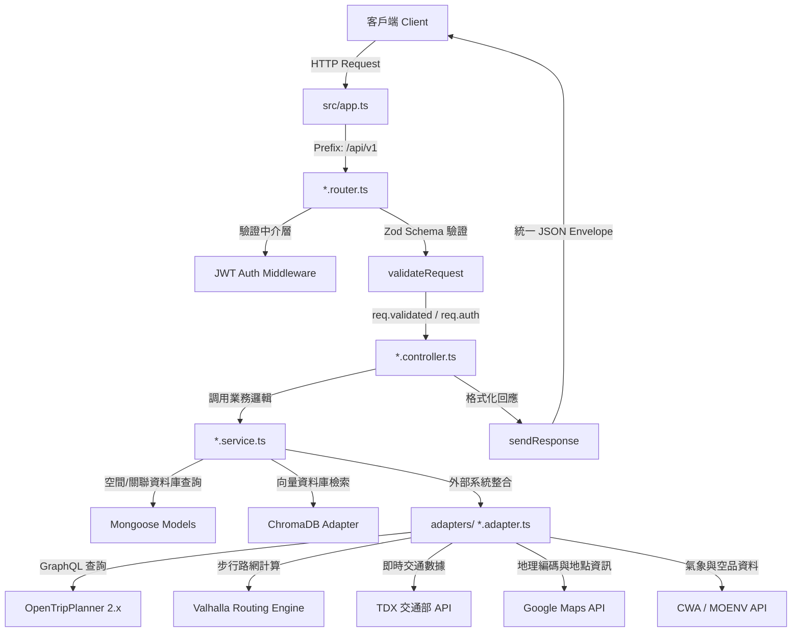

<div align="center">
    <h1>accessible-smart-map-backend</h1>

[](https://www.typescriptlang.org/)
[](https://nodejs.org/)
[](https://expressjs.com/)
[](https://opentripplanner.org/)
[](LICENSE.md)

**無障礙地圖多模態路徑規劃與即時交通數據整合 API 服務**

[快速開始](#快速開始) · [系統架構](#系統架構與請求流程) · [API 接口說明](#api-接口分組說明) · [開發與建構指令](#開發與建構指令)

</div>

---

## 目錄

- [專案概述](#專案概述)
  - [背景與痛點](#背景與痛點)
  - [系統設計與解決方案](#系統設計與解決方案)
  - [核心技術特色](#核心技術特色)
  - [無障礙導航引擎與標準導航引擎對比](#無障礙導航引擎與標準導航引擎對比)
- [系統架構與請求流程](#系統架構與請求流程)
  - [分層架構核心不變式](#分層架構核心不變式)
  - [請求處理管線流程圖](#請求處理管線流程圖)
- [核心引擎與子系統細節](#核心引擎與子系統細節)
  - [1. 多模態無障礙路徑規劃引擎 (OTP2 & Valhalla)](#1-多模態無障礙路徑規劃引擎-otp2--valhalla)
  - [2. 即時大眾運輸與通阻警報整合 (Transit Alerts & Realtime)](#2-即時大眾運輸與通阻警報整合-transit-alerts--realtime)
  - [3. AI 代理人對話與工具循環 (AI Agent & Tool Loop)](#3-ai-代理人對話與工具循環-ai-agent--tool-loop)
  - [4. 語音助理雙向串流橋接 (Voice Live Bridge)](#4-語音助理雙向串流橋接-voice-live-bridge)
  - [5. 向量記憶庫與知識檢索機制 (RAG & ChromaDB)](#5-向量記憶庫與知識檢索機制-rag--chromadb)
  - [6. 道路障礙通報與緊急求助系統 (Hazard & SOS)](#6-道路障礙通報與緊急求助系統-hazard--sos)
- [快速開始](#快速開始)
  - [1. 前置需求](#1-前置需求)
  - [2. 安裝依賴](#2-安裝依賴)
  - [3. 環境變數設定](#3-環境變數設定)
  - [4. 匯入空間與大眾運輸數據](#4-匯入空間與大眾運輸數據)
  - [5. 啟動本機服務](#5-啟動本機服務)
  - [6. 使用 Docker Compose 部署](#6-使用-docker-compose-部署)
- [開發與建構指令](#開發與建構指令)
- [API 接口分組說明](#api-接口分組說明)
- [測試與品質驗證](#測試與品質驗證)
- [授權條款](#授權條款)

---

## 專案概述

### 背景與痛點

在都市交通運輸系統中，身心障礙者與行動不便市民（如輪椅使用者、嬰兒推車家長、高齡長者）於日常出行時經常面臨空間數據破碎化與路網非連續性問題。主流導航服務（如 Google Maps、Apple Maps）多半缺乏三維空間幾何與站體內部障礙物（如階梯、天橋、無坡道之人行道）之細粒度建模，且無法即時感知無障礙設施（如捷運無障礙電梯）的運作與妥善狀態，導致規劃出的路徑常在現場遭遇物理中斷。

### 系統設計與解決方案

本專案為基於 Node.js、TypeScript 與 Express.js 建構的後端 REST API 與即時串流服務。系統深度整合多來源空間與動態交通數據：

- **靜態拓撲層**：導入 OpenStreetMap (OSM) 無障礙路網拓撲、捷運站體內部 GTFS-pathways 階層式路徑網絡、無障礙廁所、身障專用停車位與校園無障礙數據。
- **即時動態層**：對接交通部 TDX 平台，即時串接公車動態定位、軌道運輸（捷運、台鐵、高鐵）車次與電梯妥善率，並整合全台大眾運輸即時通阻警報（Transit Alerts）。
- **環境感知層**：聚合中央氣象署（CWA）天氣警報、環境部空氣品質指標（AQI）及路口監視器（CCTV）即時影像，提供行前與途中環境風險評估。
- **智能互動層**：基於大型語言模型（Gemini）建構支援工具呼叫（Tool Calling）的串流對話代理人、即時語音雙向橋接（Gemini Live WebSocket）以及向量化無障礙知識檢索庫（RAG）。

### 核心技術特色

- **多模態混合路徑規劃**：整合捷運、台鐵、高鐵、公車與步行路網，針對輪椅與行動不便者提供無階梯、坡度受控之連續無障礙路徑。
- **站體內部跨樓層導航**：支援 GTFS-pathways 與 levels 標準，建立捷運站內部「出入口 - 閘門 - 電梯 - 月台」的精準三維導引。
- **即時運輸通阻告警融合**：自動比對規劃路徑中的公車、台鐵、高鐵與捷運路段，注入即時延誤、停駛或路況異常通報。
- **AI 代理人與工具循環**：透過 Server-Sent Events (SSE) 提供對話串流，結合意圖解析、工具呼叫循環（Tool Loop）、記憶注入與路徑自然語言解說。
- **即時語音助理串流**：提供雙向音訊 WebSocket 橋接，支援無障礙語音導航與個人化記憶偏好注入。
- **社群障礙通報與生命週期管理**：支援即時道路障礙通報、照片上傳、社群確認與時間窗自動失效（Auto-Expiry）機制。
- **嚴格分層架構與邊界檢查**：遵循單向分層架構（Clean Architecture），透過 Zod 邊界驗證與自動化架構 Lint 確保代碼健全性。

---

### 無障礙導航引擎與標準導航引擎對比

| 分析維度         | 標準導航引擎                                   | accessible-smart-map-backend                          |
| :--------------- | :--------------------------------------------- | :---------------------------------------------------- |
| 物理通道約束     | 易導向階梯、人行天橋、手扶梯或缺乏緩坡之路段   | 嚴格物理約束：優先走無障礙坡道、平緩路徑與可用電梯    |
| 站體三維內部網絡 | 站體簡化為單一二維點位，忽略垂直高度與月台通道 | 站內多樓層感知：實作 GTFS-pathways 跨樓層路徑精確導引 |
| 即時狀態與妥善率 | 多僅依據靜態時刻表或車流擁塞速度估算           | 動態定位融合：整合公車/列車即時動態與設施妥善率       |
| 意外與異常告警   | 無法即時感知臨時施工、道路障礙或電梯停機       | 動態避障與告警：融合社群通報障礙與即時大眾運輸通阻    |
| 互動與多模態輔助 | 純圖文與基本語音提示                           | 支援自然語言意圖解析、路線解說、AI 對話與即時語音橋接 |

---

## 系統架構與請求流程

### 分層架構核心不變式

專案遵循單向層次架構（Clean Backend Architecture），並透過自動化規則（`pnpm lint:arch`）於建構前強制檢查：

1. **一檔一責，檔名即職責**：嚴格劃分 `*.router.ts`、`*.schema.ts`、`*.controller.ts`、`*.service.ts`、`planners/*.ts`、`adapters/*.adapter.ts`。
2. **單向依賴**：Router -> Controller -> Service -> Planners / Adapters / Models，嚴禁逆向依賴。Service 嚴禁接觸 Request / Response，Controller 嚴禁跨模組直接調用。
3. **邊界驗證**：所有外部輸入一律於 Router 經由 Zod `validateRequest({ body, query, params })` 嚴格校驗並寫入 `req.validated`。
4. **單一回應信封**：所有 HTTP 回應一律透過 `sendResponse(...)` 統一輸出標準 JSON 格式。
5. **零魔術字面值**：狀態碼使用 `ResponseCode` 列舉，錯誤訊息與常數集中維護於 `src/constants/`。
6. **單一註冊點**：所有功能模組於 `src/modules/<feature>/index.ts` 匯出 Router，統一於 `src/app.ts` 掛載於 `/api/v1` 前綴下。

### 請求處理管線流程圖



---

## 核心引擎與子系統細節

### 1. 多模態無障礙路徑規劃引擎 (OTP2 & Valhalla)

路徑規劃模組位於 `src/modules/accessible-route/`，整合 OpenTripPlanner 2.x (OTP2) 與 Valhalla 雙引擎：

- **GraphQL 行程查詢**：向 OTP2 GraphQL 端點查詢符合無障礙條件的多模態路徑（公車、捷運、台鐵、高鐵與步行）。
- **Snap 站點投影演算法**：設定 500 公尺半徑近鄰搜尋，將真實坐標投影匹配至最近的捷運站、火車站或公車站點實體入口。
- **無障礙權重評分機制**：透過 `scoring.ts` 針對階梯、坡道坡度、轉乘次數、電梯可用性進行綜合評分與路徑排序。
- **電路熔斷器保護 (Circuit Breaker)**：針對外部 OTP2 服務設計狀態熔斷機制。連續失敗達 3 次即觸發熔斷並進入 60 秒冷卻期，直接回傳友善錯誤，防止阻塞伺服器執行緒。

### 2. 即時大眾運輸與通阻警報整合 (Transit Alerts & Realtime)

- **TDX 即時數據串接**：即時抓取公車動態定位、各站預估到站時間（N1/ETA）、公車低地板與輪椅無障礙車籍標記。
- **多運具即時通阻告警 (Transit Alerts)**：整合台鐵、高鐵、捷運與公車之即時營運告警資訊，主動比對路徑中的受影響站點與路線，向使用者提示改道或注意延遲。
- **捷運電梯即時狀態**：即時更新北捷與各捷運系統之電梯運作狀態，動態排除故障電梯站點。

### 3. AI 代理人對話與工具循環 (AI Agent & Tool Loop)

位於 `src/modules/ai/` 與 `src/modules/agent/`，提供串流式智能助理服務：

- **SSE 串流輸出**：`/api/v1/ai/chat` 支援 Server-Sent Events 即時推送生成內容。
- **Tool-Loop 循環呼叫機制**：支援高達 5 輪自動工具調用，涵蓋：
  - `findGooglePlaces`：地點與店家搜尋
  - `findA11yPlaces`：無障礙設施與專用廁所、停車位查詢
  - `planAccessibleRoute`：多模態無障礙路徑規劃
  - `getBusArrivalEstimate`：即時公車到站預估
  - `getBusPosition`：公車車輛即時位置追蹤
  - `getAirQuality`：指定區域空氣品質查詢
  - `getA11yFacilityDetails`：無障礙設施詳情解析
- **語意意圖解析 (`POST /api/v1/ai/intent`)**：以自然語言提取出發地、目的地、出發時間與個人偏好。
- **路徑語意解說 (`POST /api/v1/ai/explain`)**：將結構化路徑資料轉換為易懂的無障礙導航語音提示文字。

### 4. 語音助理雙向串流橋接 (Voice Live Bridge)

位於 `src/modules/voice/`，專為行動不便或視障使用者打造的即時語音對話服務：

- **WebSocket 雙向音訊傳輸**：前端透過 WebSocket 串流 PCM 音訊至後端，後端即時橋接至 Gemini Live API。
- **個人化記憶整合**：連線建立時自動從 User Config 讀取無障礙偏好與記憶，動態注入系統提示詞（System Prompt），提供貼身導航體驗。

### 5. 向量記憶庫與知識檢索機制 (RAG & ChromaDB)

- **向量特徵提取**：使用 Google GenAI `text-embedding-004` 模型，將法規、無障礙知識庫與說明文本轉換為 768 維稠密向量。
- **ChromaDB 向量持久化**：於集合 `accessibility_knowledge` 中建立結構化 Metadata 關聯。
- **語意相關性排序**：對用戶輸入進行即時相似度檢索，動態注入 Top-K 參考資料至 LLM Context。

### 6. 道路障礙通報與緊急求助系統 (Hazard & SOS)

- **道路障礙通報 (`/api/v1/a11y/hazard`)**：使用者可上傳施工、階梯阻礙、坡道毀損等障礙資訊與照片，具備社群確認及時間窗自動失效（Expiry）維護機制。
- **緊急求助廣播 (`/api/v1/sos`)**：一鍵向設定的緊急聯絡人發送 SOS 求救廣播與即時坐標資訊。

---

## 快速開始

### 1. 前置需求

請確認本機或主機已安裝以下環境：

- **Node.js**：版本 22.x 或以上
- **pnpm**：版本 10.30.0 或以上（建議啟用 Corepack）
- **MongoDB**：版本 7.x 或以上
- **Redis**：版本 7.x（選用，用於快取與流量限制）
- **Docker & Docker Compose**（若採用容器化部署）

啟用 Node.js 內建 Corepack 以自動同步對應 pnpm 版本：

```bash
corepack enable
```

### 2. 安裝依賴

複製專案並安裝相依套件：

```bash
# 開發環境安裝
pnpm install

# 生產環境或 CI 部署（嚴格鎖定 lockfile）
pnpm install --frozen-lockfile
```

注意：請勿使用 npm 或 yarn，因建構腳本與生命週期鉤子綁定 pnpm。

### 3. 環境變數設定

複製環境變數範例檔案並完成必要配置：

```bash
cp .env.example .env
```

主要環境變數說明：

```env
PORT=5000
NODE_ENV=development
CORS_ORIGINS=http://localhost:3000

# 資料庫連線
DATABASE_URL=mongodb://localhost:27017/accessible_map
REDIS_URL=redis://localhost:6379

# 外部 API 金鑰
GOOGLE_MAPS_API_KEY=your_google_maps_api_key
GEMINI_API_KEY=your_gemini_api_key
TDX_CLIENT_ID=your_tdx_client_id
TDX_CLIENT_SECRET=your_tdx_client_secret
CWA_API_KEY=your_cwa_api_key
MOENV_API_KEY=your_moenv_api_key

# 身份驗證安全金鑰
JWT_ACCESS_SECRET=your_jwt_access_secret
JWT_REFRESH_SECRET=your_jwt_refresh_secret

# 路由與向量服務 URL
OTP_BASE_URL=http://localhost:8080
VALHALLA_BASE_URL=http://localhost:8002
CHROMA_URL=http://localhost:8100
```

### 4. 匯入空間與大眾運輸數據

系統依賴 MongoDB 內的基礎設施數據。資料來源包含本地預存檔案（`data/`）與第三方 API。所有匯入腳本自動讀取 `.env`：

**核心必要數據**：

```bash
# 匯入 OpenStreetMap (OSM) 無障礙設施資料
pnpm import:osm

# 匯入 TDX 大眾運輸站點、路線與車籍資料
pnpm import:tdx-stops
pnpm import:tdx-bus-routes
pnpm import:tdx-bus-vehicles

# 匯入 TDX 軌道運輸站點（捷運、高鐵、台鐵）
pnpm import:tdx-metro
pnpm import:tdx-thsr
pnpm import:tdx-tra

# 匯入 GTFS 室內跨樓層網絡（站內通道、電梯、月台關聯）
pnpm import:gtfs-all
```

**補充擴充數據**：

```bash
# 台北市無障礙廁所資料
pnpm import:bathrooms

# 新北市與全台身障停車格資料
pnpm import:parking
pnpm import:parking-tdx

# 全國身心障礙福利機構資料
pnpm import:welfare

# 教育部校園無障礙設施與搜尋索引
pnpm import:campus-a11y
pnpm backfill:campus-search
pnpm import:campus-facility-detail

# OSM 視覺無障礙設施（導盲磚、有聲號誌）
pnpm import:visual-a11y

# 台北捷運車站出入口無障礙設施坐標
pnpm import:a11y-metro

# RAG 知識庫文本向量化
pnpm import:rag
```

### 5. 啟動本機服務

以開發模式啟動伺服器（支援熱重載）：

```bash
pnpm dev
```

伺服器預設運行於 `http://localhost:5000`。
非生產環境可瀏覽 `http://localhost:5000/docs` 開啟 Scalar 互動式 API 文件。

### 6. 使用 Docker Compose 部署

專案提供完整的 Docker Compose 設定，一鍵啟動後端 API、MongoDB、Redis、OpenTripPlanner (OTP2)、Valhalla 與 ChromaDB：

```bash
# 背景建構並啟動所有容器服務
docker compose up -d

# 查看運行狀態與日誌
docker compose logs -f backend
```

---

## 開發與建構指令

專案常用管理與品質維護指令如下：

| 指令         | 終端指令             | 說明                                             |
| :----------- | :------------------- | :----------------------------------------------- |
| 開發啟動     | `pnpm dev`           | 啟動開發伺服器（支援 nodemon 與 dotenvx 熱重載） |
| 專案建構     | `pnpm build`         | 執行分層邊界檢查並編譯 TypeScript 至 `dist/`     |
| 生產啟動     | `pnpm start`         | 執行編譯後的生產環境代碼                         |
| 完整測試     | `pnpm test`          | 執行所有單元測試與路由整合測試（Vitest）         |
| 覆蓋率測試   | `pnpm test:coverage` | 執行測試並生成代碼覆蓋率報告                     |
| 測試監控     | `pnpm test:watch`    | 進入互動式測試監控模式                           |
| Python 測試  | `pnpm test:python`   | 執行輔助 Python 腳本測試套件                     |
| 代碼檢查     | `pnpm lint`          | 執行 ESLint 靜態檢查                             |
| 代碼修復     | `pnpm lint:fix`      | 自動修復 ESLint 規範問題                         |
| 架構邊界檢查 | `pnpm lint:arch`     | 檢查模組單向依賴與架構分層不變式                 |
| 型別檢查     | `pnpm typecheck`     | 檢查專案與測試檔之 TypeScript 型別一致性         |
| 格式化代碼   | `pnpm format`        | 透過 Prettier 統一格式化代碼                     |
| 格式檢查     | `pnpm format:check`  | 檢查代碼排版是否符合 Prettier 規範               |
| 清理產出     | `pnpm clean`         | 清除 `dist/` 建構輸出目錄                        |
| 障礙過期處理 | `pnpm hazard:expire` | 執行道路障礙通報過期排程批次處理                 |

---

## API 接口分組說明

所有路由均掛載於 `/api/v1` 前綴下：

| 掛載路徑                            | 主要控制器                        | 職責說明                                      | 認證要求                      |
| :---------------------------------- | :-------------------------------- | :-------------------------------------------- | :---------------------------- |
| `/api/v1/user/*`                    | `user.controller.ts`              | 使用者註冊、登入、Token 重新整理、偏好設定    | 混合（敏感端點需 Bearer JWT） |
| `/api/v1/user/emergency-contacts/*` | `emergency-contact.controller.ts` | 使用者個人緊急聯絡人管理                      | 需 Bearer JWT                 |
| `/api/v1/sos/*`                     | `sos.controller.ts`               | 緊急求助廣播與即時通報觸發                    | 公開 / 選擇性 JWT             |
| `/api/v1/transit/*`                 | `transit.controller.ts`           | TDX 公車/軌道即時動態、預估到站、即時通阻警報 | 公開                          |
| `/api/v1/a11y/accessible-route`     | `accessible-route.controller.ts`  | 多模態無障礙路徑規劃、評分與篩選              | 公開                          |
| `/api/v1/a11y/nav-instructions`     | `nav-instructions.controller.ts`  | 導航逐步轉彎指引與語意提示解析                | 公開                          |
| `/api/v1/a11y/hazard/*`             | `hazard-report.controller.ts`     | 道路障礙回報、社群確認與狀態更新              | 混合（回報需 Bearer JWT）     |
| `/api/v1/a11y/environment`          | `environment.controller.ts`       | 即時路口 CCTV 影像串流與氣象警報              | 公開                          |
| `/api/v1/a11y/reviews`              | `review.controller.ts`            | 地點無障礙評論、評分與回饋機制                | 混合（評論需 Bearer JWT）     |
| `/api/v1/a11y/places`               | `place-search.controller.ts`      | 無障礙設施與空間地點搜尋檢索                  | 公開                          |
| `/api/v1/a11y/welfare`              | `welfare.controller.ts`           | 全國身心障礙福利機構檢索                      | 公開                          |
| `/api/v1/a11y/visual-a11y`          | `visual-a11y.controller.ts`       | 視覺無障礙設施（有聲號誌、導盲磚）檢索        | 公開                          |
| `/api/v1/a11y/campus`               | `campus.controller.ts`            | 校園無障礙設施與地圖檢索                      | 公開                          |
| `/api/v1/air/*`                     | `air.controller.ts`               | 即時空氣品質指標 (AQI) 數據查詢               | 公開                          |
| `/api/v1/ai/*`                      | `ai.controller.ts`                | 自然語言意圖解析、路線解說與 SSE 代理人對話   | 公開                          |
| `/api/v1/voice/*`                   | `voice.controller.ts`             | Gemini Live WebSocket 雙向語音串流助理        | 需啟用環境變數                |
| `/api/v1/line/*`                    | `line.controller.ts`              | LINE 官方帳號 Webhook 整合                    | 需 LINE 簽章驗證              |

伺服器健康檢查端點：

```bash
curl http://localhost:5000/health
```

標準回應範例：

```json
{
  "status": "OK",
  "message": "Server is running",
  "timestamp": "2026-08-16T12:00:00.000Z"
}
```

---

## 測試與品質驗證

專案採用 **Vitest** 搭配 **supertest** 執行測試，不依賴外部即時連線即可完成路由層、控制器與業務服務層的整合驗證：

```bash
# 執行所有測試
pnpm test

# 執行型別檢查（涵蓋測試檔案）
pnpm typecheck

# 執行分層架構邊界檢查
pnpm lint:arch
```

### 持續整合管線 (GitHub Actions CI)

每當發起 Pull Request 或推動至 `main` 分支時，CI Pipeline 會依序執行以下七項嚴格檢核：

1. `pnpm run lint:arch`：檢查模組架構依賴邊界是否合法。
2. `pnpm run build`：驗證 TypeScript 核心編譯。
3. `pnpm run lint`：執行 ESLint 代碼品質與規範檢查。
4. `pnpm run format:check`：檢查 Prettier 程式碼格式一致性。
5. `pnpm run typecheck`：針對完整代碼與測試檔執行完整 TypeScript 型別檢查。
6. `pnpm run test:coverage`：執行測試套件並確認覆蓋率。
7. `pnpm audit --audit-level high`：執行高風險相依套件漏洞安全稽核。

---

## 授權條款

本專案採用 [MIT License](./LICENSE.md) 授權發布，歡迎自由使用、修改與擴充。
