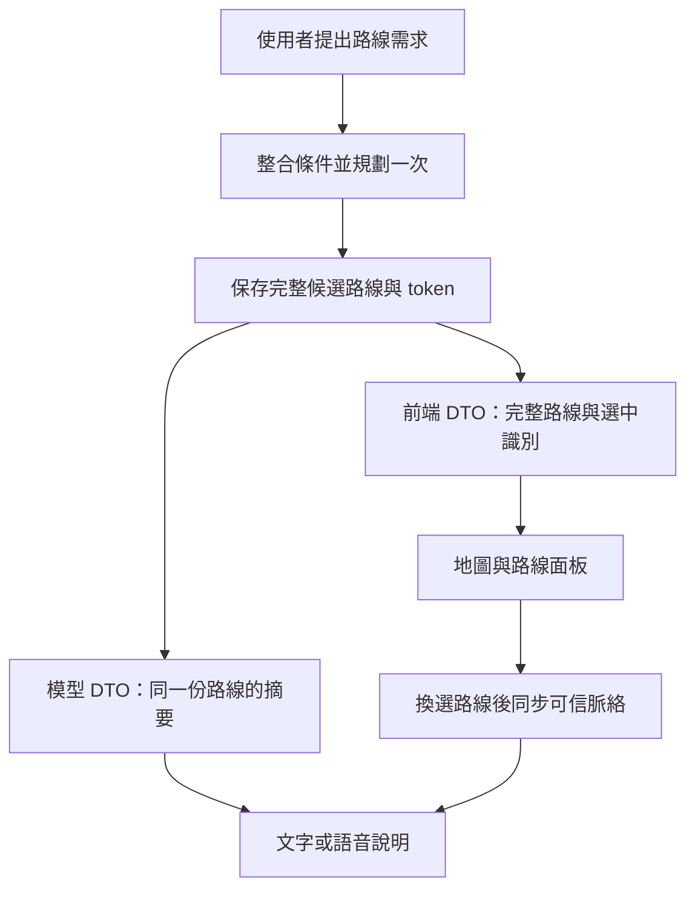

# 前端遷移說明：AI 語音、文字與地圖共用同一份路線

日期：2026-10-09

適用：`taipei-accessible-map`（Web）、`accessible-smart-map-mobile`（手機版）

狀態：**後端已在本機工作樹實作；尚未部署。Web／手機版仍需依本文遷移與實機驗收。請先確認目標環境的能力宣告，再啟用新增事件。**

## 1. 結論與修改範圍

**後端、Web 與手機版都需要修改。** 後端負責只規劃一次，從同一份結果產生「前端完整資料」與「模型摘要」；前端負責直接套用結果、同步目前選中的路線，並阻止過期回覆覆蓋新選擇。

只讓後端多回傳 polyline，現有前端可能已能走到 `show-route` 分支，但仍未處理候選路線選擇、追問細節、對話模式切換與舊結果晚到。因此不能把「地圖畫出來」視為本次遷移完成。

本次不要求重做地圖、路線面板或音訊引擎。沿用現有 `AccessibleRoute`、路線 store、`routeToken` 與導航生命週期，修改資料傳遞與選擇同步。本文不新增 HTTP endpoint。

## 2. 修正前已確認的問題

| 位置 | 修正前行為 | 問題 |
| --- | --- | --- |
| 後端 `src/modules/ai/agent-tools.ts` 的 `planAccessibleRoute`、`summarizeRoute` | 規劃後只回傳摘要；移除 polyline、routeId，沒有發出 routeToken | 同一份摘要同時交給模型與前端，前端無法直接取得完整路線 |
| Web `src/lib/ai/toolActionMapper.ts`；手機 `src/features/ai/domain/toolActionMapper.ts` | 沒有可繪製線段、有起終點時產生 `compute-route` | 前端再次規劃，畫面可能與 AI 說明不同 |
| 手機 `src/features/ai/controller/actionExecutor.ts` 的 `computeRouteAction` | 使用個人設定的 mode 重新規劃，沒有承接工具的 transitPreference、departureTime | 本輪語音指定的條件可能遺失 |
| 後端 AI 工具 `getNavInstructions` | 依起終點重新規劃，再取 routeIndex | 追問步驟可能解釋另一條路線 |
| 後端 `src/modules/agent/conversation-context.ts` | 通用深度限制把 `routes[].legs[]` 縮成 `"{…}"` | 歷史摘要失去運具與站名 |
| Web `src/lib/voice/voiceSession.ts` | `tool_result` 轉送沒有保留後端的 summary；session.start 沒有附 shared history | 不能假設 Web 已具備與手機相同的跨模式脈絡 |

原始 AI 路線摘要仍保留 `BUS`、`TRA` 等 leg.type；本次已重現的是「重算與條件遺失」，並非已證明模型在特定真實會話中把 BUS 說成 TRA。

## 3. 現有介面與後端前置工作

### 3.1 目前可用的介面

| 介面 | 認證／用途 | 本次關係 |
| --- | --- | --- |
| `POST /api/v1/ai/chat`，`stream: true` | optional Bearer auth；已有 token、tool_call、tool_result、error、done SSE 事件 | 擴充請求與事件內容，保留現有事件名稱 |
| `WS /api/v1/voice/ws` | session.start 使用有效登入 token | 擴充工具事件、會話初始化與路線脈絡同步 |
| `POST /api/v1/a11y/accessible-route` | 可匿名；有提供 Bearer token 時會驗證 | 保留手動規劃入口，AI 結果收到後不得自動再呼叫 |
| `POST /api/v1/a11y/route/instructions` | 以短效 routeToken 取得伺服器路線；router 無登入 middleware | 已能依 token 產生指引，可沿用 |
| `POST /api/v1/a11y/accessible-route/reroute` | 保留現有 optional auth 與重新規劃契約 | 只用於既有導航重新規劃流程，不作為載入 AI 結果的替代方式 |

HTTP JSON 回應沿用 `sendResponse` envelope；SSE／WS 沿用事件格式，不另包一層 HTTP envelope。`ai/chat` 的 `stream: false` 目前只回覆文字等資料，沒有完整工具結果；本次前端路線整合使用 SSE，不能假設非串流已有同樣能力。

目前 `nav.setRoute` 是「準備導航」，`getActiveNavigationContext` 只有導航 active 時才提供脈絡。**它們尚不能完整代表「使用者正在瀏覽、尚未開始導航的路線」。**

### 3.2 後端實作契約

1. 共用規劃 service 只執行一次，保存完整候選路線，再各自產生前端 DTO 與模型 DTO。沿用 route-token service 的保存機制，不呼叫自己的 HTTP endpoint，也不在 controller 複製規劃邏輯。
2. AI 工具成功結果提供完整路線與下節識別欄位。SSE、WS 都送前端 DTO；Interactions function_result 與 Gemini Live function response 都只送模型 DTO。AgentToolExecutor 已擴充為 `Promise<string | ProjectedToolResult>`，不能只把完整 JSON 同時塞進兩個消費端。
3. 文字與語音的規劃都整合本輪明示需求、目前行程條件與使用者設定；缺值才能採預設。`none` 是明確取消乘車偏好，不能當成未指定。交通偏好維持軟性偏好，目的地含「火車站」不等於偏好火車。
4. AI 工具 `getNavInstructions` 改由已選 routeToken 讀取路線，沿用 `generateNavInstructionsFromInput`；不得再依 origin/destination 或 routeIndex 偷偷重算。首次要求「帶我走」且尚無路線時，先走一次正常規劃流程。
5. 實作第 5 節的路線脈絡同步與清除；模型只能從 token 對應的伺服器資料取得目前路線，不能把前端傳回的摘要當成可信導航資料。
6. 路線專用歷史摘要優先保留選中候選識別、各段運具、路線／車次名稱、上下車站、時間、警告；上限 1200 字元，超過會先省略其他候選再減少路段，標記 truncated。完整追問以 token 脈絡為準；前端不回傳完整幾何或用自然語言充當 routeToken。
7. 更新 Zod、OpenAPI、WS schemas、工具宣告與相關測試。本文所列新增 schema 均須有輸入長度、enum、未知欄位與錯誤處理規則。

## 4. 工具結果契約（版本 1）

### 4.1 一份規劃，兩種表示



`tool_result.result` 的路線成功結果新增下列欄位；仍保留既有 origin、destination、city、mode、transitPreference、routes、alerts 等內容，以便漸進遷移。

| 欄位 | 型別／必要性 | 規則 |
| --- | --- | --- |
| `routeContractVersion` | `1`，必填 | 本文契約版本；前端不得把缺少此欄位的舊摘要當成新契約 |
| `ok` | `true`，必填 | 以 result.ok 判斷業務成功，不只看 WS 外層 ok |
| `planId` | 非空字串，必填 | 後端產生；識別這一次候選集合，不是權限憑證 |
| `selectedRouteId` | 非空字串，必填 | 必須存在於 routes；首次預設為 routes[0].routeId |
| `routes` | 非空 `AccessibleRoute[]` | 後端完整路線 DTO，保留原排序、所有可用的 legs、polyline、steps、warnings 與設施資料 |
| `effectivePreferences` | 下列物件，必填 | 後端實際採用的條件，供 UI 顯示與之後明示改條件使用 |

`effectivePreferences` 包含 `mode`、`travelMode`、`transitPreference`、`maxTransfers`、`avoidStairs`、`requireElevator`；有指定未來出發時間時包含帶時區的 `departureTime`。若實際採用坡度、廁所、扶手等其他條件，亦須保留對應欄位。型別與語意沿用 canonical request；不要輸出 userId、記憶內容或其他使用者資料。省略 departureTime 表示依規劃當時的時間處理，不代表前端可以自行重算。

路線本體沿用現有 `AccessibleRoute`。`routeId` 不保證跨不同規劃仍唯一，前端以 `(planId, routeId)` 識別候選；不得用 routeName、陣列順位或交通方式代替 identity。

`routeToken`、`navigationId`、`routeVersion` 沿用既有型別，目前是可選欄位：Redis 保存失敗時可能沒有 token。這時仍可顯示同一份完整路線與初始摘要，但不開放依 token 的後續導航／查詢，並提示目前無法啟用。不得偽造 token，也不得為取得 token 自動重算。

### 4.2 事件包裝與識別

新增 `callId` 到兩端 `tool_call`、`tool_result`；同一次工具呼叫必須使用相同值。WS 另外新增 `turnId` 到這些事件，對應一次使用者提問；同一個 socket 內的 ID 不得重複。前端不能再只用工具名稱找「最近一次參數」。

下列為**結構示意**，`routes` 的完整 JSON 以既有 AccessibleRoute schema 與後端契約 fixture 為準，不可把此片段作為完整路線測試資料：

```ts
type AiRouteToolEvent = {
  // SSE 使用 event: tool_result；WS 使用 type: "tool_result"。
  name: "planAccessibleRoute";
  callId: string;
  turnId?: string; // WS 必填；SSE 由所屬請求識別 turn。
  result: {
    routeContractVersion: 1;
    ok: true;
    planId: string;
    selectedRouteId: string;
    origin: { name: string; lat: number; lng: number };
    destination: { name: string; lat: number; lng: number };
    routes: AccessibleRoute[];
    effectivePreferences: EffectiveRoutePreferences;
    // 其餘既有 alerts、arrivalEntrance 等欄位照原語意保留。
  };
  summary: string;
};
```

此處 `EffectiveRoutePreferences` 為上節的前端型別示意；正式 JSON schema 為 OpenAPI 的 `AiRoutePlanToolResult.effectivePreferences`。工具失敗仍使用 `result.ok: false` 與 error；沒有成功路線就不切換畫面、不覆蓋目前選擇、不觸發重算。外層 WS `ok` 目前只反映工具是否拋例外，不等於規劃成功。

給模型的 DTO 必須包含同一個 planId、selectedRouteId、各候選 routeId，以及摘要後的 legs；不含 polyline 或 capability token。後端在模型執行工具時注入已驗證的 token，模型不需要自行抄寫 token。預設說明選中候選；若比較其他方案，必須明確說「另一個方案」，不能把不同方案的路段拼成一條。

SSE 會先發出對應 tool_result；含工具呼叫的回合若有暫時文字會捨棄，回答回合完成後才依原 chunks 輸出，因此首字可能稍晚。WS 先發出完整 tool_result，再將摘要送回 Gemini 產生後續語音。若前端無法套用有效結果，應中止該次回覆並顯示錯誤，避免保留舊地圖卻播放新路線說明。

## 5. 選中路線與對話同步（版本 1）

### 5.1 共用路線狀態

沿用現有 route store，新增／保存 planId、selectedRouteId、effectivePreferences；已選 routeToken、navigationId、routeVersion 從同一個 selected route 讀取。文字與語音不得各自維護另一份選中路線。

結果到達時一次更新候選集合、選中 identity、路線幾何、相關警示與查詢條件，再切換面板。不要先設定 selected index，稍後才替換 routes。使用者換選時更新同一份狀態；順序變更不改變選中 identity。

手動規劃結果也可透過 routeToken 成為對話脈絡，不必先經 AI 工具。沒有 planId 的既有手動結果，用 routeToken 識別已選路線；不要假造後端 planId。

### 5.2 文字請求與語音初始化

`POST /api/v1/ai/chat` 和 WS `session.start` 支援：

```ts
type RouteContextInput = { routeToken: string } | null;

type RouteConversationInput = {
  routeContractVersion?: 1;
  routeContext?: RouteContextInput;
  routingPreferences?: {
    mode?: "normal" | "wheelchair" | "elderly" | "visual_impaired";
    transitPreference?: "none" | "bus" | "rail" | "metro";
    departureTime?: string; // ISO 8601，帶時區
    avoidStairs?: boolean;
    requireElevator?: boolean;
  };
};
```

新前端每次文字請求與語音初始化都明確送 routeContext：有選中路線就送 token，沒有就送 null。`undefined` 只為舊客戶端相容保留，代表沒有提供同步指令；`null` 是明確清除。前端無有效 token 時送 null，不拿舊 token 冒充目前選擇。

新增物件採嚴格欄位驗證：routeToken 去除前後空白後長度 1–256；routingPreferences 只接受上列欄位、enum、boolean 與含時區 ISO 日期，不接受 HH:mm。既有 chat／session.start 頂層保留忽略未知欄位的相容行為。HTTP 格式錯誤回 400（仍受既有 auth／rate limit）；session.start 格式錯誤沿用 4401。

routingPreferences 是表單／個人設定的輸入預設，不能覆蓋已選路線的 canonical request；本輪明示修改才建立新規劃。後端仍須依既有無障礙規則解析衝突或不完整需求，不能讓 generic 預設 normal 蓋過使用者已表明的輪椅需求。

後端必須查 token 並建立可信上下文後才產生路線相關回答。帶入無效 token 的追問應回覆「路線已過期，請重新規劃」，不能默默改用更舊的記憶或重新規劃。一般非路線問題仍可正常回答。

### 5.3 語音連線中換選／清除

支援以下控制事件，與既有 nav.setRoute／nav.start 分開：

```json
{
  "type": "route.context.set",
  "requestId": "selection-7",
  "selectionVersion": 7,
  "routeContext": { "routeToken": "example-only-not-a-real-token" }
}
```

後端成功確認：

```json
{
  "type": "route.context.ack",
  "requestId": "selection-7",
  "selectionVersion": 7,
  "ok": true,
  "routeId": "candidate-b",
  "navigationId": "7c7aa19c-d60e-4b65-af01-ff2db0c6a011",
  "routeVersion": 1
}
```

route.context.set 整個物件為 strict：requestId 為去除前後空白後 1–128 字元；selectionVersion 為 0 到 Number.MAX_SAFE_INTEGER 的整數，且同一連線內每次必須嚴格遞增（相同版本重送也回 STALE_SELECTION）。格式錯誤／超過 control rate limit 的 frame 不套用、不送成功 ack；前端 timeout 後維持未同步。

清除時傳 `routeContext: null`；成功 ack 的 routeId、navigationId、routeVersion 均為 null。失敗回同一種 ack，`ok: false`，並包含 `reason: "INVALID_ROUTE_TOKEN" | "ROUTE_CONTEXT_UNAVAILABLE" | "STALE_SELECTION"`。以上為本機新後端實作的 reason；部署前舊環境仍不支援。

selectionVersion 是前端在同一 socket 內單調遞增的選擇版本，與導航 routeVersion 不同；重連後在新 socket 重新計數。後端丟棄較舊更新，前端只採用與最新 requestId、selectionVersion 相符的 ack。失敗時不得繼續以舊路線代替新選擇回答，應進入脈絡未同步狀態；重試只重送脈絡，不呼叫規劃器。

換選／清除時停止並清空舊路線的模型語音播放。後端必須取消或淘汰舊回覆，確認舊音訊不再轉送且新脈絡已建立後才 ack。前端等待 ack 期間不播放路線說明；timeout 時保留失敗狀態，不把等待時間結束視為成功。**目前下行 PCM 為無路線標籤的 binary frames，單靠 callId 或畫面切換無法擋掉舊音訊；這個停止與確認順序必須做整合驗證。**

後端收到不同選擇時，會送出 `interrupted`、關閉舊 Gemini Live 連線，淘汰其音訊／工具／關閉回呼，並以新脈絡重建上游連線後才 ack。相同 token 的預設選擇回傳不重建，避免切斷剛取得路線的說明。換選期間上行音訊不排隊；前端應暫停錄音或提示等待，ack 成功後再接受路線提問。Live 重新連線失敗會回失敗 ack，保留 client socket 與導航；需沿用 voice error 復原流程。

route.context.set 只改變對話所指的路線，不得開始、停止、重設逐步導航，也不得觸發規劃。既有 nav.setRoute／nav.start／nav.cancel／nav.resume 繼續負責導航生命週期。正在導航時，瀏覽另一候選不代表切換導航；對話須分清「目前查看」與「正在導航」的路線。「下一步／那班公車」等導航問題使用 active navigation context；若指涉不明確才確認。

### 5.4 能力確認

新後端的 `session.ready` 已增加 `capabilities: { aiRouteContractVersion: 1, routeContextSync: true }`。前端收到能力宣告後才能發送 route.context.set；只有 `{ type: "session.ready" }` 的舊回覆不表示支援。

SSE 在請求送 routeContractVersion: 1；新後端於路線結果回同版本。缺少版本或必要欄位時按第 9 節的舊後端規則處理。舊 schema 可能忽略未知欄位，因此不能把 HTTP 200 或連線成功當成新契約確認。

## 6. 前端必要修改

### 6.1 結果解析與套用

移除 AI 路線工具結果的「沒有 polyline 就 compute-route」分支。保留使用者主動按下規劃時的 computeRoute；不刪除整個手動規劃功能。

新 mapper 檢查 routeContractVersion、result.ok、非空 routes、各 routeId 唯一、selectedRouteId 存在，以及基本 route／leg 結構。通過後只產生一次套用路線 action，攜帶完整候選、選中 identity、effectivePreferences、alerts 等。不能依「任意一條有 polyline」就認定所有候選有效，也不要為純運輸 leg 缺少幾何而丟棄整份已規劃結果。

個別路段沒有幾何時，保留可信的交通方式與上下車站，顯示地圖資料不足；禁止自行補另一條規劃。必要契約缺漏時顯示可理解的錯誤，不默默重算、不把起終點補成 `(0,0)`。

結果只保存於 route session 與必要的 UI 狀態；聊天歷史只保存後端 summary。不要將完整幾何送回模型，也不要將 routeToken 放進 summary、一般紀錄、分析事件或分享網址。既有導航復原若保存 token，沿用原有儲存與登出清除規則。

### 6.2 追問詳細指引

前端的詳細指引沿用現有 HTTP endpoint：

```json
{
  "routeToken": "example-only-not-a-real-token",
  "language": "zh-TW",
  "userHeading": 45
}
```

送到 `POST /api/v1/a11y/route/instructions`，不夾帶整包 route、origin、destination 或 routeIndex；該 schema 是 strict。現在的工作樹支援 language 為 zh-TW／en，但部署版本仍須核對。[步行與導航遷移文件](./FRONTEND_MIGRATION_WALK_INSTRUCTIONS.md) 說明語言與指引欄位。

現有成功回應是 `{ ok: true, status: "success", code: 200, message, data }`，data 含 instructions、totalSteps 等。失敗至少處理 HTTP 400／`data.reason: "INVALID_ROUTE_TOKEN"`，以及其他 400、500 或網路失敗；不能把所有 400 都說成過期。無效 token 時保留畫面上的舊結果並標示不可繼續導航，讓使用者明確操作重新規劃。語音內部的 getNavInstructions 也必須由後端完成相同修正，前端改 HTTP 呼叫不會自動修好 AI 工具。

### 6.3 競態、取消與導航更新

SSE 用請求 AbortController 與本機路線狀態世代防止舊回覆更新畫面。WS 在 tool_call 時以 turnId／callId 記錄當時世代，tool_result 到達時核對；相同工具名不能作為對應鍵。換選、清除、手動新規劃、停止對話、登出與新 socket 都使舊的待套用結果失效。同一 callId 重送不得再次套用或跳頁。

後端也必須淘汰同一已取消 turn 的工具結果與模型回答；只在前端忽略地圖更新，仍可能播放舊方案。規劃中的一般「正在查詢」語音可保留，但路線事實必須等對應結果就緒才回答。

接到既有 nav.route_replaced 時沿用 navigationId／routeVersion 的版本檢查；原子替換路線、token、選中狀態與指引。若對話查看的正是被替換的導航路線，同步更新對話脈絡；正在查看不同候選時不強制改選。新的 navigationId 不能只靠 routeVersion 數字與舊導航比較。不得由此事件再觸發一次規劃。

### 6.4 對話歷史

文字請求保留 assistant.tool_summaries；語音 session.start／重連保留 history 及目前 routeContext。手機版沿用 conversationHistory 的共用轉換，Web 補上相同資料傳遞。summary 的 bounded 長度契約維持既有上限；後端應以完整欄位為單位縮減路線摘要，不能先產生長 JSON 再任意切斷。

歷史摘要只用於理解「剛才第二個」，目前路線細節以 routeContext 的伺服器資料為準。換選後舊訊息可以留在歷史，但不能讓模型以舊回答覆蓋目前選擇；清除路線後送 null，不能由歷史自動恢復選擇。

## 7. 修改檔案定位

以下路徑相對各自 repo 根目錄；既有檔案已於本次排查核對，實作前應確認是否有其他分支變更。

### 7.1 Web：taipei-accessible-map

| 檔案 | 修改責任 |
| --- | --- |
| `src/lib/ai/toolActionMapper.ts` | 移除 AI 結果自動重算；解析完整結果與選中 identity |
| `src/lib/ai/uiAction.ts`、`src/lib/ai/actionExecutor.ts` | 套用 action 傳遞 metadata；不再固定只選 routes[0] |
| `src/hook/useAIChat.ts`、`src/lib/api/ai.ts` | SSE 的 callId、summary、routeContext／偏好輸入、取消與晚到結果處理 |
| `src/lib/voice/voiceSession.ts`、`src/lib/voice/voiceSessionBindings.ts` | 能力宣告、工具 metadata、history、context set／ack、舊音訊處理；移除 AI 結果的 computeRoute sink 呼叫 |
| `src/hook/useVoiceSession.ts` | 連結目前路線、換選／清除、重連與語音同步 |
| `src/stores/useMapStore.ts` | 原子更新候選、identity、版本、alerts、effectivePreferences |
| `src/types/route.ts` | 對齊後端既有 route identity 與新增結果型別 |

`src/hook/useComputeRoute.ts` 保留手動規劃責任，不再用於補 AI 摘要。它只接受目前已有的參數；若另外擴充手動偏好功能，須依 request schema 修改，不能藉本次遷移悄悄擴大範圍。

### 7.2 手機：accessible-smart-map-mobile

| 檔案 | 修改責任 |
| --- | --- |
| `src/features/ai/domain/toolActionMapper.ts`、`uiAction.ts` | 完整結果解析、identity 與 metadata；移除 AI 自動重算 |
| `src/features/ai/domain/chatStream.ts`、`types.ts` | 保留 callId、summary 與新契約資訊，不只按工具名配對 |
| `src/features/ai/controller/chatController.ts`、`actionExecutor.ts` | 直接套用結果；停止本輪結果覆蓋新選擇；不以本機 profile 重算 |
| `src/features/ai/api/aiApi.ts`、`domain/conversationHistory.ts` | routeContext、偏好與 summary 歷史傳遞 |
| `src/features/voice/domain/voiceSession.ts`、`voiceSessionBindings.ts` | 能力宣告、turnId／callId、context set／ack 與播放清除 |
| `src/features/voice/controller/voiceController.ts` | shared history、目前路線、重連及語音／文字共用狀態 |
| `src/features/route/controller/routeSessionPort.ts`、`store/routeSessionStore.ts` | 擴充 applyComputedRoutes 與換選流程，沿用請求世代防止晚到覆蓋 |
| `src/features/route/types/route.ts` | 與後端 route identity／version 型別對齊 |

### 7.3 後端交付位置

主要涉及 `src/modules/ai/agent-tools.ts`、`ai.schema.ts`、`ai.chat.controller.ts`、`src/modules/agent/agent-manager.service.ts`、`conversation-context.ts`、`src/types/agent.ts`、`src/modules/voice/live-bridge.ts`、`voice.gateway.ts`、`voice.ws.schema.ts`、工具／提示詞宣告，以及 accessible-route 的 token 保存與投影 service。service 不依賴 controller；資料投影與路線脈絡解析不得分散複製在 SSE 與 WS。

## 8. 驗收案例

| 情境 | 必須觀察到的結果 |
| --- | --- |
| 從固定起點要求去台中火車站，規劃結果只有 BUS | UI 與模型收到相同候選的 BUS／站名；實際播報不得自行加入 TRA／THSR |
| 同起終點，第二次規劃 stub 故意回傳另一運具 | 一次 AI 規劃操作只進入共用規劃 service 一次，前端沒有再送 accessible-route，因此第二個結果不會出現 |
| 輪椅＋偏好公車＋指定未來時間 | effectivePreferences 與實際規劃條件一致；初始顯示不再用本機預設覆蓋 |
| 多候選、第一條為 BUS、第二條為 TRA | 預設都講第一條；點第二條並同步成功後，追問使用第二條的站名與運具 |
| 追問「每一步怎麼走」 | 查原 token，規劃 service 次數不增加，指引來源 route identity 一致 |
| 文字→語音→文字／語音重連 | 選中 token 與必要摘要仍在，伺服器先恢復脈絡再回答；不增加規劃呼叫 |
| 播報第一條時改選第二條 | 舊播放佇列清空，舊 binary audio 不再被轉送／播放，ack 後只解釋第二條 |
| 語音停止、清除路線或登出時工具尚未完成 | 晚到工具結果不畫路線、不跳頁、不重新播放；登出沿用既有清除規則 |
| 舊 ack 晚到／同 callId 重送／同工具呼叫兩次 | 最新選擇保持不變；事件不因工具同名而錯配 |
| token 過期或 Redis 保存失敗 | 顯示明確狀態；不偽造 token、不偷偷重算，不宣稱已開始導航 |
| 部分 leg 缺幾何、result.ok=false、空 routes、selectedRouteId 不存在 | 不把不完整資料當新方案成功；無自動重算或 `(0,0)` 假座標 |
| 導航中瀏覽其他候選、接到 nav.route_replaced | 區分查看與導航；沿用正確 identity／版本，不重設導航進度或重複規劃 |
| 舊後端、舊前端混合部署 | 符合第 9 節；不以 HTTP 200 或 socket ready 宣稱完整同步已支援 |

「只規劃一次」計算的是使用者這次操作對共用規劃 service 的呼叫；規劃器內部合理的多候選、fallback、轉乘查詢不算前端重複規劃。

測試分三層：後端驗證同一次結果的兩種 DTO 與 token 查詢；前端單元／整合測試驗證解析、store、呼叫次數與競態；Web 瀏覽器與手機實機語音驗證實際說出的內容。固定 fixture 能證明資料契約，不能代替真實 Gemini 語音驗收。驗收紀錄應對齊 tool call、selected route identity、畫面與當輪逐字稿，token 必須遮蔽。

## 9. 上線順序與舊版本行為

先在後端實作／凍結本文契約及 fixture，再讓兩端依相同 fixture 開發。後端維持舊版請求相容，透過 routeContractVersion 與 WS capabilities 明確辨識支援；前端不能先送新增事件到尚未支援的環境。

| 組合 | 行為與限制 |
| --- | --- |
| 新後端＋新前端 | 完整驗收路徑；同一次規劃、選擇同步、追問與重連全部通過才算完成 |
| 新後端＋舊前端 | 完整 routes 可讓舊 mapper 直接顯示，但換選同步、metadata 與跨模式歷史仍不完整；不宣稱問題已全面修復 |
| 舊後端＋新前端 | 不啟用新同步功能；若只有摘要，不自動重算。顯示「目前無法將這份 AI 路線載入地圖」，可讓使用者主動到手動規劃頁重新提出需求，並視為新行程 |

回滾後端時，前端同樣採舊後端行為；不能恢復「用另一份規劃假裝是原結果」。部署期間保留原導航復原能力，避免把路線脈絡同步失敗當成 nav.cancel。

## 10. 文件驗證與實作狀態

本次後端實作以 HEAD `c62568f` 為基準，在本機工作樹完成；不代表已部署。Web `8b965e4`、手機 `e4a4bda` 是前一輪核對的前端基準，本次沒有修改前端。

已實作：完整路線與模型投影、canonical 條件、token 指引、SSE callId 與取消、WS callId／turnId、初始化與選擇同步、過期結果淘汰、路線摘要及 prompt。LINE 共用工具迴圈也套用同一次對話的路線脈絡，避免 plan 後查指引時失去 token；LINE 跨訊息的選擇同步不在本次契約內。

契約與競態 fixture 可見：

- `src/modules/ai/agent-tools.test.ts`：共用規劃只呼叫一次、完整幾何、canonical 條件、token 缺失與過期。
- `src/modules/ai/route-context.service.test.ts`：資料投影、條件延續、清除、晚到 lookup／工具結果與查詢逾時。
- `src/modules/ai/ai.chat.controller.test.ts`、`src/modules/agent/agent-manager.service.test.ts`：HTTP 驗證、SSE 關聯、取消與模型結果投影。
- `src/modules/voice/live-bridge.test.ts`、`voice.gateway.test.ts`、`voice.ws.schema.test.ts`：真實本機 WS 傳輸搭配模擬 Gemini、選擇版本與過期音訊／工具回呼。

[語音協定](./specs/VOICE_WS_PROTOCOL.md)、[AI 工具參考](./specs/AI_AGENT_TOOLS_REFERENCE.md) 與 Zod／OpenAPI 已同步。最終建置與測試結果見 [後端實作報告](./reports/ai-route-consistency.md)。

尚未完成：部署、前端遷移、Web／手機實機與真實 Gemini 語音驗收。固定 fixture 與模擬回呼證明資料契約及競態防護，不能保證真實模型每句播報都不出錯；上線前仍須依第 8 節核對實際逐字稿、音訊與地圖。
